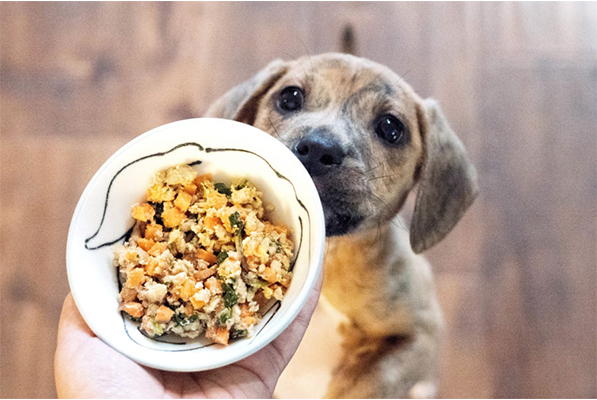

Josh Billings once wrote that dogs are the only things on this planet who will love you more than it loves itself.

With this kind of loyalty, it’s no wonder that pet parents would do anything for their beloved pups. We wake up early on a weekend and take them for a walk, go out of our way to find that one favorite toy, and spend hours and hours doing everything to make them happy. Why do we do this? It’s because they’re our family and we love them with all our might.

These are all basic facts that’s why it’s surprising to see pet parents choose dog food filled with ingredients that you would use to make astroturf stronger. Numerous studies published have shown that fresh dog food can provide pups with a multitude of health benefits. Before we delve further into why you should choose fresh dog food for your treasured companion, let’s take a brief look at your alternatives.

&nbsp;

&nbsp;

**Kibble**

Kibble refers to any type of dry dog food. This often comes in big bags that you can buy from a dog food delivery site. It’s dried which makes it a good option if you’re concerned about long-term storage. This is also the reason why kibble became a popular choice among pet owners in terms of dog food. Sounds great right? It’s actually not. When you find out what’s used to make kibble, you wouldn’t want to have it at home more so in your fur baby’s stomach. 
To start with, kibble is produced using feed-grade ingredients. What this means is that all types of animal by-products are used in producing a batch which includes roadkill, parts of diseased animal carcass, and other ingredients not certified by the USDA.

Next, you want to look at the list of ingredients. When you see the ingredients, you probably won’t recognize the majority of the names because they are chemicals that often include acrylamide, carrageenan, carcinogens, dyes (of which many are not allowed for human consumption), and a slew of other harmful ingredients. We don’t need to go into detail about the health issues that could arise from these types of ingredients.

Dry kibble has a low moisture level which can lead to reduced energy level, loss of appetite, dry eyes, gums, and nose, and weak skin elasticity. There’s a big list of reasons why kibble is not good for your pup, but we think you get the gist from the reasons we listed.

**Raw**

May pet parents who are conscious about the health of their dogs decide to switch to a raw food diet. If you want the best raw food for your dogs, you should look for products that use fresh vegetables, high-quality proteins, and healthy berries. These will provide your pup with a good dose of needed vitamins, minerals, and antioxidants in one scrumptious package. Amazing, right? It’s better than kibble for sure. However, there are still problems even with the best raw food for dogs.

For one, many services offering raw dog food use advertising that mislead customers into believing that their products are higher in quality than they actually are. If you want a raw diet that’s good for your pup, you want meals made using fresh vegetables and high-quality meat. Many brands make ambiguous claims which make their products seem more top-tier.

Another factor you need to consider is the shelf-life of raw dog food. This tends to get spoiled really quickly. When your raw food turns sour, it can be harmful to you and your pup. There are also questions surrounding the nutritional balance that raw dog food can provide. The main point is that even the top raw dog food could be dangerous for your canine and yourself as well. Our take? We don’t think it’s worth the risks.

## Why Choose Fresh Dog Food?

Now we know alternative types of dog food and the problems that could arise if you use them. But is all the buzz surrounding fresh dog food really worth the try? Or is this just a new marketing scheme to sell you one more product? Let’s look at the figures.

According to studies by researchers from Purdue University, adding fresh vegetables to your dog’s dry kibble can reduce and prevent the growth of cancer cells by 70-90 percent. It’s not a secret that cancer is among the top causes of death in dogs above 10 years of age. If that’s not enough to encourage you to switch, let’s take a look at other benefits that studies have found from a fresh dog food diet.

**Better Digestion**

Processed kibble and other types of dog food contain different kinds of fillers that are not good for your dog’s stomach. These include legumes that are high in starch and genetically engineered corn. High-quality fresh dog food is prepared with the health of dogs in mind. This means that the meals are made with ingredients that can be easily digested in their tummies as well as ingredients that are meant for canines.

A dog’s digestive tract will find fresh food easier to process which makes it a healthier and safer option. In addition, when you switch to fresh dog food, you can see an immediate improvement in your pup’s bowel movements. Their waste will be fewer, cleaner, and have a less unpleasant odor since they digest the food properly and they don’t digest any of the junk commonly found in processed kibble.

**Boost immune system**

Fresh fruits and vegetables are rich in vitamins, minerals, and antioxidants such as vitamin A and vitamin C. There are also zinc-rich proteins that are used in prepping fresh dog food. All these ingredients give your dog’s immune system a huge boost which translates to fewer visits to the vet because you have a healthier pup overall.

&nbsp;

&nbsp;

**Softer coat**

Aside from better digestion and a stronger immune system, you can also see significant improvements in your pup’s skin and coat. There is an increasing number of dogs that experience rashes, skin irritations, and dandruff which most pet owners believe are due to allergens. But this is not typically the case. Veterinarians see that the increased cases of skin irritations can be attributed to the type of food that pet owners feed their dogs.

A fresh dog food diet with high-quality ingredients can help reduce the appearance of itching, dry, and irritated skin. This is due to the essential fatty acids in the ingredients including omega 3, 6, and 9. It’s like drinking a bottle of clean and refreshing water when you’re extremely thirsty. Fresh food can help hydrate your dog’s skin and leave softer and shinier coats.

**Weight maintenance + longer life expectancy**

A fresh food diet has also been shown to help dogs maintain healthier weights. In the first weeks of starting the new diet, pet owners reported a healthy change in their dog’s weight. Veterinary nutritionists will tell you that maintaining healthy weight maintenance can increase life expectancy in dogs by 20%. You’ll have more chances to run, play, and cuddle with your best bud. Studies have also shown that fresh dog food can lead to a better range of motion and more activeness even with senior dogs.

## Best Brands of Fresh Dog Food

New delivery services offering fresh food have cropped up to answer pet owners’ demands. However, you should do your research before you buy from any website since not all of them are the same. The top delivery services we recommend for fresh dog food are Ollie, Nom Nom, and The Farmer’s Dog.

The best delivery services will help you customize a diet plan that’s based on your dog’s age, breed, weight, and more. With a personalized plan, you know that your pooch is getting the proper amount of nutrients that their body requires. The top delivery services will deliver the food directly to your house, allow flexible delivery schedules, and have the option for recurring subscription plans.

## When to serve fresh food to puppies?

You can start serving fresh food to puppies 3 to 4 weeks after their birth which is during the weaning period. The earlier you can wean a puppy of the mother dog’s milk, the easier they can adjust to proper food (and the faster the mother can recover her health). When feeding puppies, freshly cooked food is important since raw food contains pathogens that could quickly overcome their undeveloped immune system.

Another thing you need to consider is that puppies have a huge need for calories. The National Research Council of the National Academies recommends 990 calories for a 10-pound puppy that’s from small to medium-sized breeds. This is equivalent to the caloric needs of an active adult dog weighing 30 to 35 pounds and is twice the requirement for a 10-pound adult dog. Fresh food for puppies should have a good mix of carbohydrates, proteins, fats, and vegetables.
