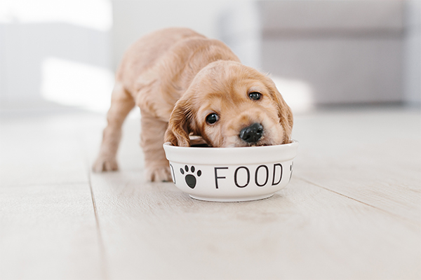
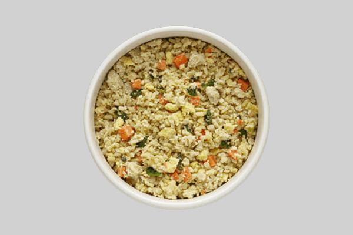

As a good pup parent, you want to feed your furry baby the best food that you can afford to fuel a healthy lifestyle. You've heard of raw food diet, canned, frozen, and dried alternatives that are you'll find almost anywhere.

Generally, there are four kinds of dog food that you can keep in your pantry. Dry dog food, depending on the quality, can be a great source of required nutrients. Fresh dog food provides nutritious and healthy ingredients. Frozen dog food is sold in fresh and raw options. Canned dog food is a type of wet food that many puppies choose over dry kibble. Kibble is usually known as the fast-food of dog food- it's quick and easy to serve but lacks nutritional value.

## Decisions

There's an abundance of options for pet owners. Now, the question for you is what type of food is best served to your pets. The answer to this question will vary based on several factors such as your dog's age, health condition, disposition, activeness, and more. However, there are a few common principles that pet owners can use when choosing food options for their dogs. Let's have a detailed look at some of these choices.

## Fresh Food

Fresh dog food provides the perfect combination of proteins, vitamins, and minerals. It's shown that having fresh vegetables included in one meal a day can make a significant improvement in a dog's health. Fresh food delivery services offer various flavors that you can choose from which will provide your pup a balanced diet. Many fresh food delivery services will even help you choose which one is s the best recipe for your dog.

One thing you need to take note of is that there is a significant distinction between raw food and fresh food when we talk about dog food delivery. Raw food refers to food that has not undergone any cooking process. For carnivorous dogs, this can be a healthy diet. However, there may be issues that could arise. Some companies write USA meat or USDA-certified factory on their packaging which often misleads people into thinking that the food is USDA-certified when it's not.

Another problem that occurs even with the top-rated dog food delivery service is the freshness and preservation of raw food. Although raw food can be a healthy diet, it's a difficult job to constantly maintain it. Keeping your meat fresh is tricky, even more so if you have a small fridge. When the freshness of raw dog food is not maintained, it may get contaminated with e Coli, salmonella, and other harmful pathogens. This is why raw dog food can be dangerous to both dogs and humans if they're not properly handled.

Fresh dog food meanwhile refers to dog food that uses non-processed, current ingredients that do not include junk that often gets used for mass-produced products. The best delivery services for dog food will use real fruits, vegetables, and human-grade proteins without additives, hormones, or preservatives.

Research has shown that both raw and fresh dog food are significantly better for animals compared to processed dog food.

## Dry Food

Dry dog food doesn't come with the difficulty of maintaining freshness which means there's a lower chance of the food getting spoiled. Still, there are issues with your typical dry processed dog food referred to as kibble. When you open a bag of dry food, the fats in the kibble will start to go sour. Over time, as your pup regularly consumed the rancid dry food, they can suffer from protein and vitamin deficiencies.

There are other issues associated with dry food aside from this. They are often made using feed-grade ingredients (non-USDA certified, diseased meats), as well as additives, preservatives, and carcinogens that could have harmful and even fatal effects on your dog. Even if your pup is in good health, kibble can lead to other negative health conditions such as abnormal weight loss or gain, allergies, irritated digestive tract, irritated and dry skin, and an increase in cancer-producing cells.

## Fresh Dried Food

If you want to stick with dry food, the best options you have are those made using premium and quality ingredients. These are dried to preserve the freshness and flavor of the food. Unlike dry kibble, fresh dried food meets industry standards on nutritional value and quality. 
One of the best dry food comes from Spot & Tango. The brand uses whole foods and their products are developed by canine nutritionists. The food is dried using low temperatures in order to maintain the nutrients in the ingredients.

## Which is the right option for your pup?

The easy answer is that fresh food is the better option. It has the highest nutritional value per gram, has fewer issues in terms of maintaining freshness, and is easily digested. Now, your next question might be what is the best fresh dog food or delivery service? This is not as easy to answer since there are several great choices in the market. You have Ollie, Nom Nom Now, and The Farmer's Dog competing for the best delivery service title.

Furthermore, the perfect delivery service for one family might not suit another. For instance, the best food for smaller breeds is not the same as the best one for senior dogs. There are several factors to consider when you're looking for the right food for your pup.

### Allergies

Does your pooch have allergies? Many brands of processed dog food contain junk that could trigger allergies for dogs. If you're worried about your pet having an allergy, get them tested at the vet. If your pooch does have allergies, you need to look for dog food that doesn't have that specific ingredient.

### Sensitive Stomach

Although your pup might not have a specific food allergy, food ingredients can still affect them if they have a weak stomach. Genetically engineered wheat, corn, and other grains as well as additives can cause tears inside a dog's digestive tract. This is one reason pet owners say no to dry kibble.

The good thing is a good brand of fresh dog food doesn't have these types of ingredients. For dogs with sensitive stomachs or who are picky eaters, real fresh food is the best type of dog food.

### Skin Issues

Skin conditions are common issues that arise from low-quality dog food. Dogs can suffer from rashes and overall dryness due to the low moisture level of processed foods. If this is a problem for your pup, look for dog food that has high water content so that it can be digested easily. This will help keep your dog's fur, skin, and insides hydrated.

### Price

Price is a given factor with any purchase that we make. Most pet owners think that giving high-quality food to their pups will be too expensive for their budget. However, did you know that there are fresh, all-natural meals using human-grade ingredients that cost less than $2 per plate? You can get even more savings if you sign up for a subscription plan.

### Storage & Expiration Date

Many pet owners believe that kibble is the first place in terms of food with the longest shelf-life. But this is not entirely true all the time. We mentioned earlier that the fats in kibble quickly turn rancid once the packaging is open. If you're looking for dog food with the longest expiration period, the best option is dry dog food which contains real ingredients and that were slowly dried out for a longer shelf-life.

### Expected results

Evaluating your dog food ends at the changes that your pup goes through after consuming it regularly. The best dog food delivery services will provide meals that can give your pup healthier skin, shiner, coat, better bowel movements, better breath, healthier digestion, better weight maintenance, higher energy level, and longer life expectancy.
