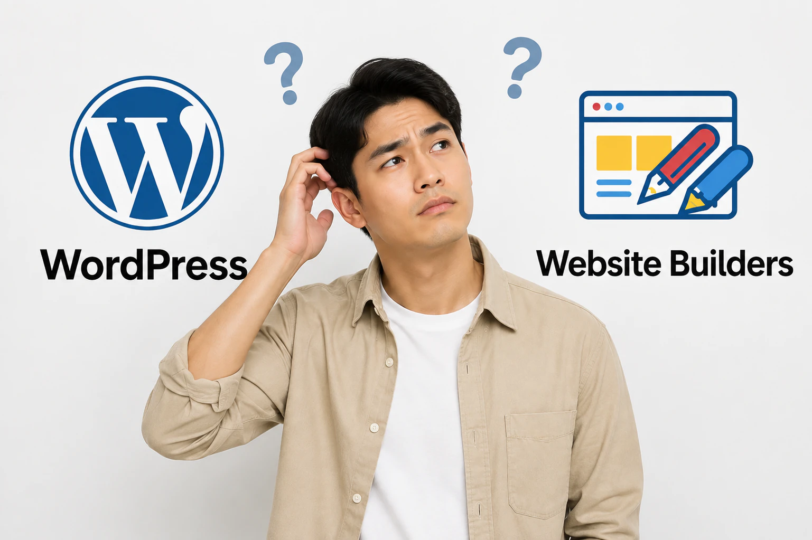

Starting a website often begins with one important decision. You must choose the platform that will power your website. Two common options are website builders and WordPress. Both allow users to create websites without deep technical knowledge. However, the experience and long-term control can differ.

Many beginners feel confused when comparing these two options. Website builders promise quick setup and simple design tools. WordPress offers stronger flexibility but may require extra setup and maintenance. The right choice depends on your goals, budget, and technical comfort level.

This guide explains how website builders compare with WordPress. You will learn about setup, cost, customization, and long-term management. By the end, beginners can clearly understand which option makes more sense.

## Understanding Website Builders

Website builders are platforms that allow users to create websites through visual tools. They combine hosting, templates, and editing features in one system. Most builders work through a drag-and-drop editor that makes design simple.

Beginners usually prefer website builders because the setup process is quick. Users sign up, choose a template, and start editing content. The platform manages hosting, security updates, and technical maintenance.

Website builders also include built-in tools for SEO, blogging, and ecommerce. These features reduce the need for extra plugins or advanced setup. Many platforms offer mobile-ready templates that work on phones and tablets.

The biggest advantage of website builders is convenience. Users focus on content and design while the platform handles the technical side.

Popular website builders include platforms like Wix, Squarespace, Webador, and Shopify.

## Understanding WordPress

WordPress is a powerful content management system used by millions of websites. It started as a blogging platform but now supports many website types. Businesses, publishers, and developers rely on WordPress for flexibility.

Unlike website builders, WordPress requires separate hosting and domain setup. Users install the WordPress software on a hosting provider. After installation, they can customize the website using themes and plugins.

Themes control the visual design of the website. Plugins add features such as contact forms, SEO tools, ecommerce functions, and analytics.

WordPress offers much greater control compared to most website builders. However, beginners may need time to learn the system. Managing updates, plugins, and security settings also requires attention.

For users willing to learn the platform, WordPress can support almost any website idea.

## Website Builder vs WordPress: Key Differences

Understanding the core differences helps beginners choose the right platform. Each option serves a different type of user.

| Feature | Website Builders | WordPress |
| --- | --- | --- |
| Setup Difficulty | Very easy setup | Moderate setup process |
| Hosting | Included with platform | Requires separate hosting |
| Customization | Limited to builder features | Highly customizable |
| Maintenance | Managed by the platform | User manages updates |
| Cost Structure | Monthly subscription | Hosting plus optional plugins |
| Learning Curve | Beginner friendly | Requires some learning |

Website builders focus on simplicity and speed. WordPress focuses on flexibility and control.

## Ease of Setup for Beginners

Setup is often the biggest concern for new website owners. Beginners usually want a platform that works quickly.

Website builders are designed for easy onboarding. After creating an account, users choose a template and begin editing content. Most builders provide guided steps that help users launch their site.

WordPress requires a few extra steps. Users must purchase hosting and install WordPress on the server. Many hosting companies now provide one-click installation tools.

Once WordPress is installed, users still need to select themes and configure plugins. This process takes more time than using a website builder.

For beginners who want the fastest launch, website builders usually provide the smoother experience.

## Design and Customization Options

Website design plays a major role in branding and user experience. Both platforms offer templates and customization tools.

Website builders provide ready-made templates designed for different industries. Users modify colors, fonts, and page layouts through visual editors. The design process feels similar to editing a document.

However, customization options remain limited to the platform's design tools. Advanced design changes may not be possible.

WordPress offers far greater customization potential. Thousands of themes allow users to choose unique designs. Developers can also modify themes using custom code.

Plugins expand the platform even further. Users can add booking systems, membership portals, learning platforms, and more.

Beginners who want simple customization may prefer builders. Users planning complex websites may benefit from WordPress.

## Cost Comparison

Pricing is another major factor when choosing a website platform. Costs can vary depending on features and hosting requirements.

Website builders use a monthly subscription model. The subscription includes hosting, design tools, security, and platform updates.

Typical pricing looks like this:

| Platform Type | Typical Monthly Cost |
| --- | --- |
| Basic website builder plan | $10 - $20 |
| Advanced builder plan | $25 - $40 |
| Ecommerce builder plan | $30 - $80 |

WordPress itself is free software. However, users must pay for hosting and optional services.

Typical WordPress costs include:

| WordPress Cost Item | Average Price |
| --- | --- |
| Hosting | $5 - $30 per month |
| Domain name | $10 - $20 per year |
| Premium themes | $40 - $80 one time |
| Premium plugins | $20 - $200 depending on features |

For simple websites, the total cost may remain similar between both options. Larger WordPress websites can become more expensive depending on plugins and hosting upgrades.

## SEO and Marketing Capabilities

Search visibility matters for any website owner. Both website builders and WordPress provide SEO tools.

Website builders include built-in SEO settings. Users can edit page titles, descriptions, and URL structures. Some builders also provide analytics dashboards and marketing tools.

However, advanced SEO control may be limited compared to WordPress.

WordPress offers stronger SEO capabilities through plugins. Popular plugins provide advanced features such as sitemap generation, keyword optimization, and content analysis.

Marketing integrations also work well on WordPress. Users can connect email marketing platforms, CRM systems, and advertising tools.

For beginners running simple websites, builder SEO tools are usually enough. Businesses focused on content marketing often prefer WordPress.

## Maintenance and Technical Management

Managing a website requires regular updates and security checks. This responsibility differs between both platforms.

Website builders handle maintenance automatically. The platform manages server updates, security patches, and system upgrades. Users rarely worry about technical problems.

WordPress requires more involvement from the website owner. Themes and plugins must be updated regularly. Security monitoring also becomes important.

Some hosting providers offer managed WordPress plans that reduce these tasks. Even then, WordPress users should understand basic maintenance.

Beginners who prefer less technical responsibility may feel more comfortable with website builders.

## Ecommerce Capabilities

Many beginners want to sell products online. Both platforms can support ecommerce websites.

Website builders often include built-in store tools. Users can add product listings, manage inventory, and accept payments quickly. Platforms such as Shopify specialize in ecommerce features.

WordPress also supports ecommerce through plugins like WooCommerce. This system transforms a WordPress site into a full online store.

WooCommerce provides strong flexibility but requires additional setup. Users must configure shipping, payment gateways, and product categories.

Small stores may launch faster with a website builder. Larger online stores often choose WordPress for deeper customization.

## When a Website Builder Makes More Sense

Website builders work best for beginners who want simplicity. Users can launch websites quickly without learning technical systems.

These platforms work well for personal websites, portfolios, and small business pages. Freelancers, local services, and bloggers often prefer builders.

Website builders also suit users who want predictable pricing and minimal maintenance. The platform handles hosting, security, and updates.

For many beginners, this convenience saves time and reduces stress.

## When WordPress Makes More Sense

WordPress becomes the stronger choice for long-term flexibility. Users can customize almost every aspect of their website.

Businesses planning large content websites often choose WordPress. Publishers, membership platforms, and online learning sites rely on its flexibility.

WordPress also allows deeper control over SEO and marketing tools. Users can install specialized plugins that expand the platform's capabilities.

Beginners who are comfortable learning new systems may benefit from WordPress over time.

## Final Thoughts

Choosing between a website builder and WordPress depends on your priorities. Both platforms help beginners create websites, but their strengths differ.

Website builders focus on simplicity and quick setup. They provide visual editing tools and built-in hosting. Beginners can launch websites within hours.

WordPress offers greater control and customization. The platform supports complex websites and advanced features. However, it requires more setup and maintenance.

Beginners who want an easy starting point may prefer website builders. Users planning long-term growth and advanced customization may find WordPress more suitable.

Understanding these differences helps you make a smarter decision. The right platform should match your skills, goals, and future website plans.
