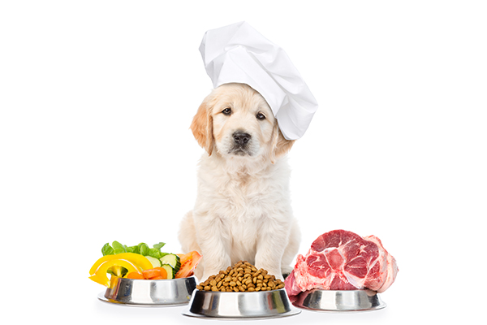
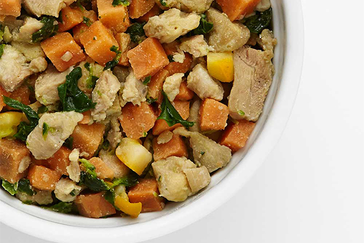

Raw or natural diet is a trend that's popular in a growing number of pet owners. There are numerous benefits to serving this type of food to pets and it's remarkable how fast you can see results. Cats and dogs can get softer and shinier coats, more energy levels, and better digestion in just the first week of consuming raw or natural food. As they maintain a raw or natural diet, pet owners will notice an improvement to their pet's routine and the change will also help them achieve a healthier weight, whether they need to gain or lose.

What is natural pet food? Here we talk about everything related to natural pet food, whether you just found out about the trend or you've been serving raw or natural dog food for a long time.

## What ingredients are used for natural pet food?

The exact list of ingredients that are used in natural pet food will vary depending on the brand or service you buy it from. However, there are standard rules that the best names in the industry will follow to provide high-quality food for your pets. Aside from hearty staples such as sweet potatoes and rice, here's a list of ingredients that are often used for top-quality pet food.

**Real food**

Natural pet food will use high-quality ingredients. Most services will tell you that their recipes are made with human-grade ingredients. This means that if it's good enough for human consumption, then it's also good enough for your best bud. It's a huge step up from the typical junk that's used in highly processed food which often includes fillers, byproducts, and chemicals with names you've never heard of before.

**Fruits and Vegetables**

Natural pet food will include plenty of real fruits and vegetables. You'll find a generous serving of vegetables such as potatoes, kale, yellow squash, carrots, broccoli, pumpkin, and spinach. They will also include something a bit sweeter using fruits healthy for the heart and packed with antioxidants such as blueberries.

**Lots of protein**

When we get to the basics, natural pet food companies make sure that your furry companion gets the best in every meal. Recipes are packed with top-notch proteins to help your pet lead a healthier lifestyle. Check the labels to find out the quantities of each ingredient before you purchase. Good brands will include lots of protein such as chicken, beef, turkey breasts, lamb, beef liver, tilapia, eggs, and salmon.

A lot of healthy pet food makers will also go above and beyond in terms of the quality of their protein ingredients even though it's not a requirement. Some will choose responsibly sourced and free-range proteins such as pasture-raised lamb, high-quality turkey and beef, and hormone-free chickens.

**Essential Vitamins & Minerals**

Every meal is packed with essential vitamins and minerals for your pup's health. You'll find the following vitamins and minerals and more in your pet's meals:

{/* Bản gốc gõ ký tự chấm tròn rồi ngắt dòng bằng   — thủ thuật thay cho
    thẻ danh sách. Nay là <ul> thật, bullet do CSS sinh. */}

- Vitamin B1
- Vitamin B2
- Vitamin B6
- Vitamin E
- Zinc
- Iron
- Copper
- Taurine
- Potassium
- Choline
- Cholecalciferol
- Selenium
- Manganese sulfate

**Extra for Additional Nutrition**

High-quality pet food will take it a step further by including a few additional ingredients to help boost the pet's health and nutrition. They can include ingredients such as chia seeds, cod liver, oil, chickpeas, and coconut oil which will give your pet's meals a boost of essential vitamins and minerals.

These ingredients are not among the list of regularly used ingredients for pet food. You will find that a lot of high-quality natural pet food brands do not use such ingredients. However, when you find a product that does have these added items, you know you hit gold.

**What they don't include**

Aside from loading up pet meals with natural and healthy ingredients, natural and raw pet foods have a specific list of ingredients that they don't use in order to uphold similar healthy standards for every meal. Wheat, corn, and soy that act as typical fillers for processed pet food. The thing is, these ingredients can interfere with cats' and dogs' stomachs which can make it more difficult for them to digest their food. These can also lead pets to produce have blocked digestive and urinary tracts.

Natural pet food will not use preservatives, coloring agents, or artificial flavors.

**Making Natural Pet Food**

Aside from using healthy, nutritious, and human-grade ingredients, natural pet food is produced using optimal methods to keep cats and dogs thriving and happy. The Farmer's Dog describes that surviving is different from thriving. To live their lives to the fullest, pet owners should serve their companion natural dishes made with the greatest care.

**Strict hygiene and safety protocols**

All pet meals are made in the best health conditions that are carefully set up to meet health regulations. USDA kitchens ensure that their ingredients and production process meet quality and safety standards. Natural pet food made in these kitchens will uphold the level of quality that is expected for your furry companion. Many brands will even deliver fresh meals to your door or they will flash freeze the meals to seal flavor and maintain freshness. 
Pass nutrition standards

Not all pets are the same. A 2-month-old kitten will have significantly different nutritional needs from a Bernese mountain dog. If you want to give your furry companion adequate nutrients, the meals you serve them should be prepared following their nutritional needs. We know that, as a pet owner, this can be difficult. The good news is that natural pet food brands are responsive when it comes to these standards. They have veterinary nutritionists in their team to make sure that they develop nutritionally balanced meals with the proper combination of carbs, fats, proteins, and vitamins and minerals.

In addition, you will find the leading brands of natural pet food have met or even surpassed the Association of American Feed Control Officials standards. The meals that they produce will contain the right amount of nutrients for cats' and dogs' daily nutritional requirements. For instance, the AAFCO standards require at least 18% of protein in adult dog food.

**Custom meal plans**

Natural pet food services will also allow you to customize meal plans according to your pet's needs. A meal plan will vary based on the breed, age, and weight of your dog as well as their activity level and allergies. A pet profile will help pet owners get the perfect meal plan for their fur babies

**Choose the Brand for You**

Back then, kibble was the sole option for pet owners who want to have well-fed pets. But in this age where health is our top priority, pet owners are gearing up to change the type of feed they serve their pets. There's an abundance of options if you want your pet to have a healthier and more balanced diet. Ollie, The Farmer's Dog, and Nom Nom are just some of the brands that deliver great quality meals.

To find a service that caters to your needs, it's important to do your research. Make sure to compare features and prices, what advantages they can offer, and reviews that legitimate customers have left. It's also essential to find a service that covers your location.

**You Will Enjoy Going Natural**

The year is 2021 and it's time to switch to natural pet food. Start your pet's journey towards a healthier, happier, and more qualitative life. Both you and your pets will enjoy the changes that a good diet can bring, from shinier coats, higher energy levels, healthier stomachs, and digestive systems.
