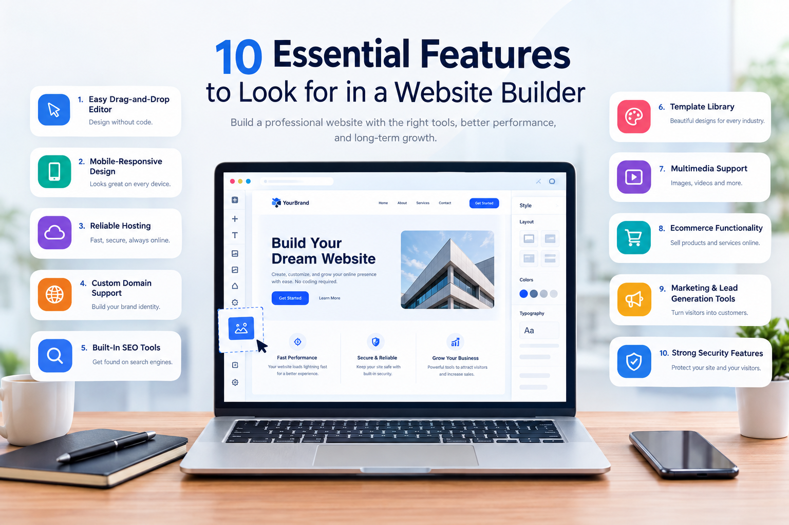

## About Bubble

Bubble is a powerful platform for building web applications without code. It was created for entrepreneurs, startups, and businesses. You can design, develop, and launch complex apps using a visual editor. Bubble provides total design freedom and handles web hosting. It is not only for basic websites or blogs. This tool is best for creating interactive, multi-user applications. Think of building a service like Airbnb or Twitter. Bubble gives you the tools to create that level of complexity.

For website building, Bubble works best for users who want more than a simple static site. It lets you build custom web pages, landing pages, dashboards, member portals, marketplaces, directories, booking platforms, and other interactive website experiences. Users can design the front end visually while also adding database, workflow, and user-account features in the same platform.

## Key Features

Bubble comes packed with features that replace traditional programming. These tools allow you to manage databases, create user logic, and connect to other services. The platform is designed to be an all-in-one solution for app development. Its visual interface is central to the entire building experience. Below are some of the most important features that Bubble offers its users.

* **Visual Drag-and-Drop Editor:** Design your user interface by dragging elements onto a page.
* **Custom Workflows:** Define what happens when users click buttons or interact with elements.
* **Integrated Database:** Create and manage your application's data directly within Bubble.
* **API Connector:** Connect your app to hundreds of external services and data sources.
* **User Management System:** Easily build sign-up, login, and user account functionality.
* **Responsive Design:** Create layouts that adapt to different screen sizes, like mobile and desktop.
* **Plugin Marketplace:** Extend your app's capabilities with free and paid add-ons.
* **Website Design Tools:** Build custom web pages with templates, components, reusable elements, and full visual design control.
* **SEO Settings:** Add page-level and app-level SEO details to help public pages appear more clearly in search results.
* **Custom Domain Support:** Connect your Bubble-built website or web app to a professional branded domain on paid plans.

## Pricing Plans

Bubble offers several pricing tiers to match different needs. The plans scale from a free option for learning to dedicated plans for large businesses. Each tier provides more server capacity, features, and support. Choosing the right plan depends on your project's stage and expected user traffic. Below is a breakdown of the main plans available. Prices reflect billing on an annual basis, which offers a discount.

For website builders, the Free plan is useful for learning, testing, and building a project before launch. A paid plan is needed when you are ready to launch a live website and connect a custom domain. This makes Bubble a better fit for serious website projects, web apps, client portals, and online platforms rather than quick one-page sites.

| Plan    | Monthly Price (Billed Annually) | Server Capacity | Key Features                                       |
| ------- | ------------------------------- | --------------- | -------------------------------------------------- |
| Free    | $0                              | Shared          | Bubble branding, learning and staging environment. |
| Starter | $29                             | Shared          | Live app, custom domain, recurring workflows.      |
| Growth  | $119                            | Shared          | 2 application editors, two-factor authentication.  |
| Team    | $349                            | Shared          | 5 application editors, sub-apps for development.   |

*Note: Bubble also offers dedicated server plans for larger applications that require more power and control, with custom pricing.*

## Detailed Features

To truly understand Bubble, you must look closer at its core components. The platform is more than just a simple page builder. It is a complete development environment. It combines front-end design with back-end logic and database management. This integrated approach is what makes it so powerful. Here are some of the most important aspects explained in more detail.

**The Visual Editor**

The editor is where you will spend most of your time. It gives you a blank canvas to build your app's interface. You can drag buttons, text, images, and forms directly onto the page. Every element can be customized with great precision. You control the size, color, font, and position. This allows for pixel-perfect designs without writing any CSS code.

**Workflow Logic**

Workflows are Bubble's version of programming. You create logic by setting up "when this happens, do that" rules. For example, "When a user clicks the 'Sign Up' button, create a new user account." You can build multi-step workflows to handle complex tasks. This system lets you manage data, navigate users, and trigger animations visually.

**Database Management**

Every application needs a way to store and retrieve data. Bubble includes a built-in, fully-featured database. You can define your own data types, like "User," "Product," or "Listing." Then you can add fields to each type, such as a user's name or a product's price. All data management happens in a simple, spreadsheet-like interface.

## How to Get Started

Starting a new project in Bubble is a straightforward process. The platform is designed to help you begin building quickly. Before you start, it is helpful to have a clear idea of the app you want to create. Sketching out your pages and user flow can save a lot of time. Follow these steps to begin your no-code development journey with Bubble.

1. **Create an Account:** Sign up for a free account on the Bubble.io website.
2. **Start a New App:** Click the "New App" button and give your project a name.
3. **Complete the Application Assistant:** Bubble will ask a few questions to set up basic styles and fonts.
4. **Take the Interactive Lessons:** Follow the built-in tutorials to learn the editor's core functions.
5. **Design Your UI:** Go to the "Design" tab and start adding elements to your pages.
6. **Build Your Database:** In the "Data" tab, define the data types your application will need.
7. **Create Workflows:** Visit the "Workflow" tab to add logic and interactivity to your design elements.
8. **Preview and Test:** Use the "Preview" button to test your application in a live environment at any time.

## Support and Community

Learning a new platform can be challenging. Bubble provides several resources to help users succeed. These support channels are vital for troubleshooting problems and learning best practices. The community, in particular, is one of Bubble's strongest assets. Both new and experienced builders can find help. You are never truly alone when building your application on the platform.

The official Bubble documentation is comprehensive and covers every feature. They also offer a series of video tutorials for visual learners. For direct help, paid plan users can submit support tickets. The most valuable resource is the community forum. It is an active place where users help each other solve problems, share tips, and showcase their projects.

## The Final Verdict

Bubble is an excellent choice for building custom web applications without code. It is ideal for founders and businesses that need more than a standard website. The platform gives you the power to create complex, data-driven products. You can build marketplaces, social networks, and internal business tools. Its visual approach to development saves immense time and money.

However, Bubble is not for everyone. It has a significant learning curve, especially for non-technical users. It is also not built for creating simple blogs or landing pages. Other website builders are better for those tasks. If you are willing to invest time in learning, Bubble can bring your app idea to life. It truly empowers you to build and launch a professional web application.